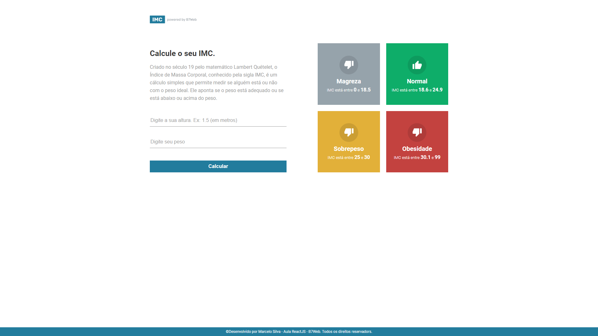

# Calculadora de IMC

Esta aplicação foi desenvolvida para conclusão de atividade do modulo 4 do curso de ReactJs + TypeScript da [B7Web](https://alunos.b7web.com.br/)

## 🚀 Começando

Para ter acesso a aplicação, basta acessar o link: https://calculate-your-imc.netlify.app/

### 🎥 Usabilidade e funcionalidades

Informe a sua altura e o seu peso(Obs: altura como é mostrado no placeholder do input).
Depois só clicar em calcular.

## 🛠️ Construído com

Todo o projeto foi construído utilizando:

* [Tailwind](https://tailwindcss.com/docs/guides/vite) - Biblioteca para pegar componentes e container.
* [Vite](https://vitejs.dev/guide/why.html#slow-server-start)
* [TypeScript](https://www.typescriptlang.org/docs/) - Para tipagem
* [ReactJS](https://pt-br.reactjs.org/docs/getting-started.html) - Framework
* [Netlify](https://www.netlify.com/) - Utilizado para fazer deploy do front-end.

## 📌 Versão

Todo controle de versão foi realizado dentro do repositório do GitHub.

## ✒️ Autores

* **Marcelo Silva** - *Todo front-end da aplicação* - [/EuMarcel0](https://github.com/EuMarcel0)

## 📄 Licença

Open Source

## 🎁 Expressões de gratidão

Fico muito grato por ter concluído este projeto, pois foi o primeiro projeto do curso de ReactJS, e por mais que já tivesse feito outro, neste senti que o desafio foi maior.
💻🚀😊
